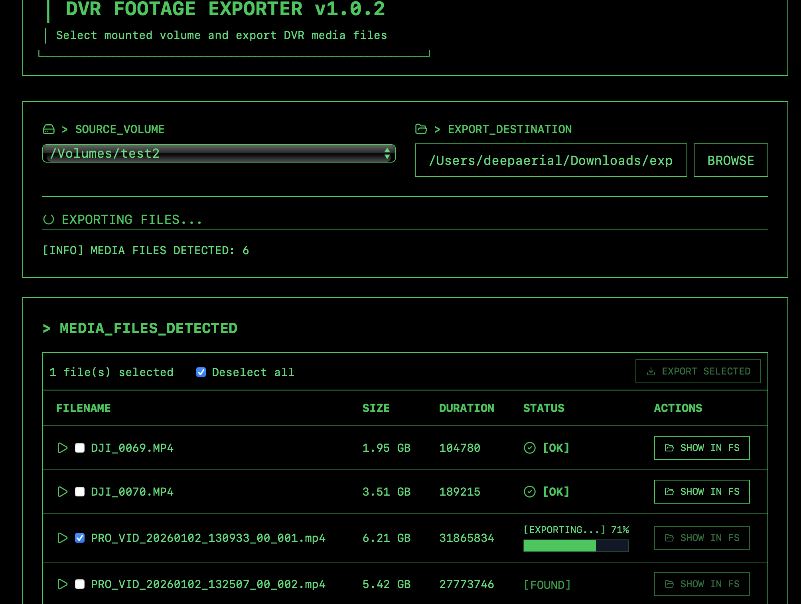

# DVR Auto-Importer

A modern desktop application to streamline the export of DVR footage recorded by DJI Goggles (or other devices) from microSD cards. Built with [Wails](https://wails.io/), Go, and React.


> App semi-vibecoded with Github Copilot and Gemini CLI.

## Features

- **Automated Scanning:** Quickly scan mounted volumes (SD cards, external drives) for media files.
- **Smart Detection:** Automatically detects `.mp4`, `.srt`, `.mov`, `.mkv`.
- **Organized Export:** Copies files into subdirectories named by their creation date (`YYYY-MM-DD`) for organization.
- **Duplicate Prevention:** Checks for existing files in the destination to avoid redundant copies.
- **Real-time Progress:** Visual progress bars for each file during the export process.
- **Quick Access:** Reveal exported files in Finder/File Explorer directly from the app.
- **Terminal UI:** A terminal-inspired aesthetic (will probably change in the future).

## Configuration

The application can automatically set a default export destination using the `DVR_EXPORT_PATH` environment variable.

### Set Environment Variable (macOS/Linux)
Add this to your `~/.zshrc` or `~/.bash_profile`:
```bash
export DVR_EXPORT_PATH=~/Nextcloud/FPV/Videos  
```

## Getting Started

### Prerequisites
- [Go](https://go.dev/) (v1.24+)
- [Node.js](https://nodejs.org/) & [npm](https://www.npmjs.com/)
- [Wails](https://wails.io/) CLI

### Development
Run the application in development mode:
```bash
wails dev
```

### Build
Generate a production-ready application bundle:
```bash
wails build
```
For macOS, this will create a `DVRAutoimporter.app` in the `build/bin` directory.

## Technical Details
- **Backend:** Go (using `github.com/wailsapp/wails/v2`)
- **Frontend:** React (TypeScript)

## Legacy Script (macOS only)
The original Applescript version is still available as a fallback in the root directory:
```bash
osascript DVRImporter.applescript
```
*Note: The legacy script is no longer the primary focus and does not include the advanced features of the desktop app.*

---
> **Important:** This application is primarily tested on macOS.